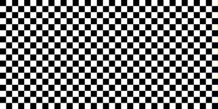

# Aufgabe 1

Diese Datei ist ein Beispiel für den Aufbau der Dokumentation, die zusammen mit der Implementierung
jeder Lösung zu erstellen ist. Der Basisname der Datei entspricht der *Id* der Aufgabe, in diesem Fall
ist der Name also `a01.md`.

## Bild



Auch das Bild ist nach der *Id* der Aufgabe benannt. In diesem Fall: `a01.png`.

## Lösung

Der Kern der Lösung ist in der Methode `colorForRedSquareOnBlue()` zu sehen. Diese Methode entscheidet
abhängig von der Position des Pixels im Bild, welche Farbe der Pixel erhält.

```java
static int colorForRedSquareOnBlue(int x, int y) {
    int size = 100;
    if (Math.abs(width / 2 - x) < size / 2 && Math.abs(height / 2 - y) < size / 2)
        return new Color(255, 0, 0).getRGB();
    else
        return new Color(200, 200, 255).getRGB();
}
```

### Hintergrund

Der Hintergrund ist konstant *blau*. Für jeden Pixel (x, y) wird ein konstanter Farbwert erzeugt.

(Die 1. Aufgabe fordert einen Blauverlauf in vertikaler Richtung.)

### Quadrat

Es wird ein Quadrat mit der Kantenlänge 100 Pixel dargestellt. Dazu wird der Mittelpunbkt des Bildes
berechnet. Jeder Pixel, der in X- und in Y-Richtung weniger als 50 Pixel vom Zentrum entfernt liegt,
wird *rot* eingefärbt, alle anderen Pixel erhalten die Hintergrundfarbe.

(Die 1. Aufgabe fordert eine Kreisscheibe.)

## Quellen

Hier werden alle Quellen angegeben, die für die Lösung herangezogen wurden. Besonders wichtig ist es,
die Herkunft nicht selbst verfasster Code-Schnipsel anzugeben. Auch hilfreiche Blog-Seiten und
Beiträge auf Stackoverflow oder Wikipedia sind hier zu nennen.
